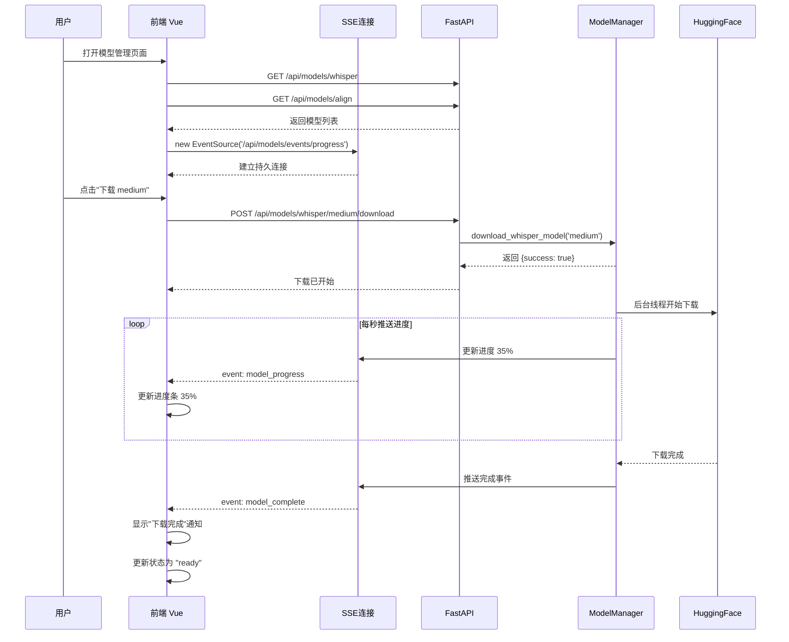

# 模型管理系统补充开发文档

## 📋 文档概述

本文档基于当前已实现的模型管理功能，提供完整的补充开发规范，**重点采用 SSE（Server-Sent Events）架构替代传统轮询**，实现实时进度推送。

**文档版本**: v1.0
**创建日期**: 2025-11-18
**适用范围**: video_to_srt_gpu 项目 - 阶段2.5模型管理系统

---

## 📊 当前实现状态分析

### ✅ 已实现部分

#### 1. 后端服务层

| 文件 | 功能 | 状态 |
|------|------|------|
| `backend/app/services/model_manager_service.py` | 模型下载、删除、状态管理 | ✅ 完成 |
| `backend/app/services/model_preload_manager.py` | 预加载、LRU缓存、单模型管理 | ✅ 完成 |
| `backend/app/services/transcription_service.py` | 集成对齐模型自动下载 | ✅ 完成 |
| `backend/app/services/ffmpeg_manager.py` | FFmpeg自动检测和下载 | ✅ 完成 |

**核心能力**:
- ✅ 6个Whisper模型管理（tiny, base, small, medium, large-v2, large-v3）
- ✅ 12种语言对齐模型管理
- ✅ 后台线程下载，状态跟踪（not_downloaded, downloading, ready, error）
- ✅ 转录时自动检测并下载缺失的对齐模型（等待最多5分钟）
- ✅ 删除模型同时清理内存缓存

#### 2. API 路由层

| 端点 | 方法 | 功能 | 状态 |
|------|------|------|------|
| `/api/models/whisper` | GET | 列出所有Whisper模型 | ✅ 完成 |
| `/api/models/align` | GET | 列出所有对齐模型 | ✅ 完成 |
| `/api/models/whisper/{model_id}/download` | POST | 下载Whisper模型 | ✅ 完成 |
| `/api/models/align/{language}/download` | POST | 下载对齐模型 | ✅ 完成 |
| `/api/models/whisper/{model_id}` | DELETE | 删除Whisper模型 | ✅ 完成 |
| `/api/models/align/{language}` | DELETE | 删除对齐模型 | ✅ 完成 |
| `/api/models/progress` | GET | 获取所有下载进度（轮询） | ✅ 完成 |

#### 3. 预加载管理器集成

| API | 功能 | 状态 |
|-----|------|------|
| `/api/models/preload/status` | 获取预加载状态 | ✅ 完成 |
| `/api/models/cache/status` | 获取缓存状态 | ✅ 完成 |
| `/api/models/preload/start` | 启动预加载 | ✅ 完成 |
| `/api/models/cache/clear` | 清空缓存 | ✅ 完成 |
| `/api/models/preload/reset` | 重置失败计数 | ✅ 完成 |

### ❌ 缺失部分

| 功能 | 优先级 | 影响 |
|------|--------|------|
| SSE 实时进度推送端点 | 🔴 高 | 前端需要持续轮询，性能差 |
| 前端 ModelManager.vue 组件 | 🔴 高 | 无法通过UI管理模型 |
| 模型下载进度细粒度回调 | 🟡 中 | 无法实时显示百分比进度 |
| 前后端交互文档 | 🟡 中 | 开发效率低 |
| HuggingFace下载进度钩子 | 🟢 低 | 当前仅能显示 0% 或 100% |

---

##  核心架构改进：SSE 替代轮询

### 为什么使用 SSE？

| 对比维度 | 传统轮询 | SSE (Server-Sent Events) |
|----------|---------|--------------------------|
| **网络开销** | 高（每秒多次HTTP请求） | 低（单个持久连接） |
| **实时性** | 差（取决于轮询间隔） | 优（服务端主动推送） |
| **服务器压力** | 大（频繁创建连接） | 小（复用长连接） |
| **实现复杂度** | 简单 | 中等 |
| **浏览器支持** | 所有 | 现代浏览器（IE除外） |
| **断线重连** | 需手动实现 | 浏览器自动重连 |

**结论**: SSE 是模型下载进度推送的最佳选择，相比 WebSocket 更轻量，相比轮询更高效。

---

## 📐 SSE 架构设计

### 1. SSE 端点规范

#### 1.1 统一进度推送端点

```
GET /api/models/events/progress
```

**功能**: 实时推送所有模型的下载进度和状态变化

**请求参数**:
- 无（使用 `EventSource` 建立连接）

**响应格式** (SSE 标准):
```
Content-Type: text/event-stream
Cache-Control: no-cache
Connection: keep-alive

event: model_progress
data: {"type": "whisper", "model_id": "medium", "status": "downloading", "progress": 35.6, "speed_mbps": 2.4}

event: model_progress
data: {"type": "align", "model_id": "zh", "status": "downloading", "progress": 68.2, "speed_mbps": 3.1}

event: model_complete
data: {"type": "whisper", "model_id": "medium", "status": "ready", "total_time_seconds": 120}

event: model_error
data: {"type": "whisper", "model_id": "large-v3", "status": "error", "error": "Network timeout"}

event: heartbeat
data: {"timestamp": 1700000000}
```

**事件类型**:
| 事件名 | 触发时机 | 数据结构 |
|--------|---------|---------|
| `model_progress` | 下载进度更新（每秒） | `{type, model_id, status, progress, speed_mbps}` |
| `model_complete` | 下载完成 | `{type, model_id, status, total_time_seconds}` |
| `model_error` | 下载失败 | `{type, model_id, status, error}` |
| `model_deleted` | 模型被删除 | `{type, model_id, deleted_at}` |
| `heartbeat` | 每30秒心跳 | `{timestamp}` |

#### 1.2 单模型进度推送端点

```
GET /api/models/events/{type}/{model_id}
```

**功能**: 仅推送指定模型的进度（用于详情页）

**路径参数**:
- `type`: `whisper` 或 `align`
- `model_id`: 模型ID或语言代码

**示例**:
```
GET /api/models/events/whisper/medium
GET /api/models/events/align/zh
```

**响应格式**: 同上，但仅包含该模型的事件

---

### 2. 后端实现方案

#### 2.1 在 `model_routes.py` 添加 SSE 端点

```python
# backend/app/api/routes/model_routes.py

from fastapi import APIRouter
from fastapi.responses import StreamingResponse
import asyncio
import json
from typing import AsyncGenerator

router = APIRouter(prefix="/api/models", tags=["models"])

@router.get("/events/progress")
async def stream_all_progress():
    """SSE端点：推送所有模型下载进度"""

    async def event_generator() -> AsyncGenerator[str, None]:
        """事件生成器"""
        model_mgr = get_model_manager()
        last_state = {}

        try:
            while True:
                # 获取当前所有模型状态
                current_state = {
                    "whisper": {
                        m.model_id: {
                            "status": m.status,
                            "progress": m.download_progress
                        }
                        for m in model_mgr.list_whisper_models()
                    },
                    "align": {
                        m.language: {
                            "status": m.status,
                            "progress": m.download_progress
                        }
                        for m in model_mgr.list_align_models()
                    }
                }

                # 检测变化并推送
                for model_type in ["whisper", "align"]:
                    for model_id, state in current_state[model_type].items():
                        last = last_state.get(model_type, {}).get(model_id, {})

                        # 状态或进度变化
                        if state != last:
                            event_data = {
                                "type": model_type,
                                "model_id": model_id,
                                "status": state["status"],
                                "progress": state["progress"]
                            }

                            # 确定事件类型
                            if state["status"] == "ready" and last.get("status") != "ready":
                                event_name = "model_complete"
                            elif state["status"] == "error":
                                event_name = "model_error"
                            else:
                                event_name = "model_progress"

                            # 推送事件
                            yield f"event: {event_name}\n"
                            yield f"data: {json.dumps(event_data)}\n\n"

                last_state = current_state

                # 每秒检查一次
                await asyncio.sleep(1)

                # 每30秒发送心跳
                if int(asyncio.get_event_loop().time()) % 30 == 0:
                    yield f"event: heartbeat\n"
                    yield f"data: {json.dumps({'timestamp': int(time.time())})}\n\n"

        except asyncio.CancelledError:
            # 客户端断开连接
            logger.info("SSE连接已关闭")

    return StreamingResponse(
        event_generator(),
        media_type="text/event-stream",
        headers={
            "Cache-Control": "no-cache",
            "Connection": "keep-alive",
            "X-Accel-Buffering": "no"  # 禁用nginx缓冲
        }
    )
```

#### 2.2 在 `model_manager_service.py` 添加进度回调机制

**需要改进的地方**（当前实现缺失）：

```python
# backend/app/services/model_manager_service.py

class ModelManagerService:
    def __init__(self):
        # ...现有代码...

        # 新增：进度回调注册表
        self._progress_callbacks = []  # List[Callable[[str, str, float], None]]

    def register_progress_callback(self, callback):
        """注册进度回调函数"""
        self._progress_callbacks.append(callback)

    def _notify_progress(self, model_type: str, model_id: str, progress: float):
        """通知所有注册的回调"""
        for callback in self._progress_callbacks:
            try:
                callback(model_type, model_id, progress)
            except Exception as e:
                self.logger.error(f"进度回调失败: {e}")

    def _download_whisper_model_task(self, model_id: str):
        """下载任务（需要添加进度通知）"""
        try:
            model = self.whisper_models[model_id]

            # 模拟进度更新（实际需要HuggingFace钩子）
            for progress in range(0, 101, 10):
                model.download_progress = progress
                self._notify_progress("whisper", model_id, progress)
                time.sleep(1)  # 实际由下载速度决定

            # ...现有下载逻辑...

        except Exception as e:
            # ...错误处理...
            self._notify_progress("whisper", model_id, 0)  # 重置进度
```

#### 2.3 HuggingFace 下载进度钩子

**问题**: 当前 `whisperx.load_model()` 无法获取实时下载进度

**解决方案**: 使用 `huggingface_hub` 的底层API

```python
from huggingface_hub import hf_hub_download, snapshot_download
from tqdm import tqdm

def download_with_progress(repo_id: str, callback):
    """带进度的模型下载"""

    class ProgressCallback:
        def __init__(self, total_size):
            self.total = total_size
            self.current = 0

        def __call__(self, size):
            self.current += size
            progress = (self.current / self.total) * 100
            callback(progress)

    # 使用 huggingface_hub 下载
    snapshot_download(
        repo_id=repo_id,
        cache_dir=str(config.HF_CACHE_DIR),
        resume_download=True,
        local_files_only=False,
        # 进度回调需要自定义实现
    )
```

---

### 3. 前端实现方案

#### 3.1 ModelManager.vue 组件规范

```vue
<!-- frontend/src/components/ModelManager.vue -->

<template>
  <div class="model-manager">
    <!-- 头部标签页 -->
    <el-tabs v-model="activeTab">
      <el-tab-pane label="Whisper模型" name="whisper">
        <ModelList
          :models="whisperModels"
          type="whisper"
          @download="handleDownload"
          @delete="handleDelete"
        />
      </el-tab-pane>

      <el-tab-pane label="对齐模型" name="align">
        <ModelList
          :models="alignModels"
          type="align"
          @download="handleDownload"
          @delete="handleDelete"
        />
      </el-tab-pane>

      <el-tab-pane label="缓存管理" name="cache">
        <CacheManager
          :cache-info="cacheInfo"
          @clear-cache="handleClearCache"
        />
      </el-tab-pane>
    </el-tabs>

    <!-- 全局下载队列（可折叠） -->
    <DownloadQueue
      v-if="downloadingModels.length > 0"
      :models="downloadingModels"
    />
  </div>
</template>

<script setup>
import { ref, onMounted, onUnmounted } from 'vue'
import { useModelStore } from '@/stores/modelStore'
import { ElMessage } from 'element-plus'

const activeTab = ref('whisper')
const modelStore = useModelStore()

// 计算属性（从 store 获取）
const whisperModels = computed(() => modelStore.whisperModels)
const alignModels = computed(() => modelStore.alignModels)
const downloadingModels = computed(() => modelStore.downloadingModels)
const cacheInfo = computed(() => modelStore.cacheInfo)

// 生命周期
onMounted(() => {
  modelStore.connectSSE()  // 建立SSE连接
  modelStore.fetchModelList()  // 初始加载
})

onUnmounted(() => {
  modelStore.disconnectSSE()  // 断开SSE连接
})

// 事件处理
const handleDownload = async (type, modelId) => {
  try {
    await modelStore.downloadModel(type, modelId)
    ElMessage.success(`开始下载 ${modelId}`)
  } catch (error) {
    ElMessage.error(`下载失败: ${error.message}`)
  }
}

const handleDelete = async (type, modelId) => {
  try {
    await ElMessageBox.confirm(`确定删除模型 ${modelId}?`, '警告', {
      type: 'warning'
    })
    await modelStore.deleteModel(type, modelId)
    ElMessage.success('删除成功')
  } catch (error) {
    if (error !== 'cancel') {
      ElMessage.error(`删除失败: ${error.message}`)
    }
  }
}

const handleClearCache = async () => {
  await modelStore.clearCache()
  ElMessage.success('缓存已清空')
}
</script>
```

#### 3.2 Pinia Store (modelStore.js)

```javascript
// frontend/src/stores/modelStore.js

import { defineStore } from 'pinia'
import axios from 'axios'

export const useModelStore = defineStore('model', {
  state: () => ({
    whisperModels: [],
    alignModels: [],
    cacheInfo: {},
    eventSource: null,  // SSE连接对象
  }),

  getters: {
    // 正在下载的模型
    downloadingModels: (state) => {
      const whisper = state.whisperModels.filter(m => m.status === 'downloading')
      const align = state.alignModels.filter(m => m.status === 'downloading')
      return [...whisper.map(m => ({...m, type: 'whisper'})),
              ...align.map(m => ({...m, type: 'align'}))]
    },

    // 统计信息
    stats: (state) => ({
      whisperReady: state.whisperModels.filter(m => m.status === 'ready').length,
      whisperTotal: state.whisperModels.length,
      alignReady: state.alignModels.filter(m => m.status === 'ready').length,
      alignTotal: state.alignModels.length,
    })
  },

  actions: {
    // 获取模型列表
    async fetchModelList() {
      try {
        const [whisperRes, alignRes] = await Promise.all([
          axios.get('/api/models/whisper'),
          axios.get('/api/models/align')
        ])
        this.whisperModels = whisperRes.data
        this.alignModels = alignRes.data
      } catch (error) {
        console.error('获取模型列表失败:', error)
        throw error
      }
    },

    // 建立 SSE 连接
    connectSSE() {
      if (this.eventSource) {
        console.warn('SSE连接已存在')
        return
      }

      console.log('建立SSE连接...')
      this.eventSource = new EventSource('/api/models/events/progress')

      // 监听进度更新
      this.eventSource.addEventListener('model_progress', (e) => {
        const data = JSON.parse(e.data)
        this.updateModelProgress(data.type, data.model_id, data.progress, data.status)
      })

      // 监听下载完成
      this.eventSource.addEventListener('model_complete', (e) => {
        const data = JSON.parse(e.data)
        this.updateModelProgress(data.type, data.model_id, 100, 'ready')
        this.$notify.success({
          title: '下载完成',
          message: `模型 ${data.model_id} 下载成功`
        })
      })

      // 监听下载失败
      this.eventSource.addEventListener('model_error', (e) => {
        const data = JSON.parse(e.data)
        this.updateModelProgress(data.type, data.model_id, 0, 'error')
        this.$notify.error({
          title: '下载失败',
          message: `模型 ${data.model_id}: ${data.error}`
        })
      })

      // 监听连接错误
      this.eventSource.onerror = (error) => {
        console.error('SSE连接错误:', error)
        // 浏览器会自动重连，无需手动处理
      }

      console.log('SSE连接已建立')
    },

    // 断开 SSE 连接
    disconnectSSE() {
      if (this.eventSource) {
        this.eventSource.close()
        this.eventSource = null
        console.log('SSE连接已断开')
      }
    },

    // 更新模型进度（内部方法）
    updateModelProgress(type, modelId, progress, status) {
      const list = type === 'whisper' ? this.whisperModels : this.alignModels
      const model = list.find(m =>
        type === 'whisper' ? m.model_id === modelId : m.language === modelId
      )

      if (model) {
        model.download_progress = progress
        model.status = status
      }
    },

    // 下载模型
    async downloadModel(type, modelId) {
      const url = type === 'whisper'
        ? `/api/models/whisper/${modelId}/download`
        : `/api/models/align/${modelId}/download`

      await axios.post(url)

      // 立即更新状态为 downloading
      this.updateModelProgress(type, modelId, 0, 'downloading')
    },

    // 删除模型
    async deleteModel(type, modelId) {
      const url = type === 'whisper'
        ? `/api/models/whisper/${modelId}`
        : `/api/models/align/${modelId}`

      await axios.delete(url)

      // 立即更新状态
      this.updateModelProgress(type, modelId, 0, 'not_downloaded')
    },

    // 清空缓存
    async clearCache() {
      await axios.post('/api/models/cache/clear')
      await this.fetchModelList()
    }
  }
})
```

#### 3.3 ModelList 子组件

```vue
<!-- frontend/src/components/ModelManager/ModelList.vue -->

<template>
  <div class="model-list">
    <el-table :data="models" stripe>
      <el-table-column prop="name" label="模型名称" width="200">
        <template #default="{ row }">
          <span class="model-name">
            {{ row.model_id || row.language }}
            <el-tag v-if="row.cached" size="small" type="success">已缓存</el-tag>
          </span>
        </template>
      </el-table-column>

      <el-table-column prop="description" label="描述" />

      <el-table-column prop="size_mb" label="大小" width="120">
        <template #default="{ row }">
          {{ row.size_mb }} MB
        </template>
      </el-table-column>

      <el-table-column label="状态" width="200">
        <template #default="{ row }">
          <!-- 未下载 -->
          <el-tag v-if="row.status === 'not_downloaded'" type="info">
            未下载
          </el-tag>

          <!-- 下载中 -->
          <div v-else-if="row.status === 'downloading'" class="downloading">
            <el-progress
              :percentage="row.download_progress"
              :stroke-width="12"
              :status="row.download_progress === 100 ? 'success' : null"
            />
            <span class="progress-text">{{ row.download_progress.toFixed(1) }}%</span>
          </div>

          <!-- 已就绪 -->
          <el-tag v-else-if="row.status === 'ready'" type="success">
            已就绪
          </el-tag>

          <!-- 错误 -->
          <el-tag v-else-if="row.status === 'error'" type="danger">
            下载失败
          </el-tag>
        </template>
      </el-table-column>

      <el-table-column label="操作" width="200">
        <template #default="{ row }">
          <!-- 下载按钮 -->
          <el-button
            v-if="row.status === 'not_downloaded' || row.status === 'error'"
            type="primary"
            size="small"
            @click="$emit('download', type, row.model_id || row.language)"
          >
            <el-icon><Download /></el-icon>
            下载
          </el-button>

          <!-- 下载中（禁用） -->
          <el-button
            v-else-if="row.status === 'downloading'"
            type="primary"
            size="small"
            disabled
            loading
          >
            下载中...
          </el-button>

          <!-- 删除按钮 -->
          <el-button
            v-if="row.status === 'ready'"
            type="danger"
            size="small"
            @click="$emit('delete', type, row.model_id || row.language)"
          >
            <el-icon><Delete /></el-icon>
            删除
          </el-button>
        </template>
      </el-table-column>
    </el-table>
  </div>
</template>

<script setup>
import { Download, Delete } from '@element-plus/icons-vue'

defineProps({
  models: {
    type: Array,
    required: true
  },
  type: {
    type: String,
    required: true,
    validator: (value) => ['whisper', 'align'].includes(value)
  }
})

defineEmits(['download', 'delete'])
</script>

<style scoped>
.model-name {
  display: flex;
  align-items: center;
  gap: 8px;
}

.downloading {
  display: flex;
  align-items: center;
  gap: 12px;
}

.progress-text {
  font-size: 12px;
  color: #606266;
}
</style>
```

---

## 📡 完整交互流程

### 流程图



### 详细步骤

#### 阶段1: 页面初始化（0-2秒）

| 步骤 | 前端动作 | 后端响应 | 耗时 |
|------|---------|---------|------|
| 1 | 挂载 ModelManager.vue | - | 0ms |
| 2 | 调用 `modelStore.fetchModelList()` | - | 0ms |
| 3 | 发送 GET /api/models/whisper | 查询6个Whisper模型状态 | 50ms |
| 4 | 发送 GET /api/models/align | 查询12个对齐模型状态 | 50ms |
| 5 | 渲染模型列表 | - | 100ms |
| 6 | 调用 `modelStore.connectSSE()` | - | 0ms |
| 7 | 创建 `new EventSource()` | 建立 SSE 连接 | 200ms |
| 8 | SSE 连接成功 | 开始监听事件 | - |

**总耗时**: ~400ms

#### 阶段2: 用户下载模型（异步）

| 步骤 | 前端动作 | 后端响应 | 耗时 |
|------|---------|---------|------|
| 1 | 用户点击"下载 medium" | - | 0ms |
| 2 | 发送 POST /api/models/whisper/medium/download | 启动下载线程 | 50ms |
| 3 | 显示"下载已开始"提示 | - | 0ms |
| 4 | 立即更新状态为 "downloading" | - | 0ms |
| 5 | - | 后台线程下载模型 | 60-300s |
| 6 | 通过 SSE 接收进度更新 (每秒) | 推送 `model_progress` 事件 | 持续 |
| 7 | 更新进度条 (0% → 100%) | - | 持续 |
| 8 | 接收 `model_complete` 事件 | - | 0ms |
| 9 | 显示"下载完成"通知 | - | 0ms |
| 10 | 更新状态为 "ready" | - | 0ms |

**总耗时**: 1-5分钟（取决于网络速度）

#### 阶段3: 转录时自动下载对齐模型

| 步骤 | 触发点 | 后端动作 | 耗时 |
|------|-------|---------|------|
| 1 | 转录服务检测到语言 "zh" | - | 0ms |
| 2 | 调用 `_get_align_model('zh')` | - | 0ms |
| 3 | 检测到模型未下载 | - | 10ms |
| 4 | 触发 `model_mgr.download_align_model('zh')` | 启动下载 | 50ms |
| 5 | 进入等待循环（每5秒检查） | - | 持续 |
| 6 | 检查状态: downloading 35% | 继续等待 | 5s |
| 7 | 检查状态: downloading 78% | 继续等待 | 5s |
| 8 | 检查状态: ready | 退出等待 | 0ms |
| 9 | 调用 `whisperx.load_align_model()` | 加载到内存 | 3s |
| 10 | 返回模型对象 | - | 0ms |

**总耗时**: 1-5分钟（首次）或 3秒（已下载）

---

## 🛠️ 开发实施清单

### 后端任务

| 任务 | 文件 | 预计工时 | 优先级 |
|------|------|---------|--------|
| 实现 SSE 端点 `/api/models/events/progress` | `backend/app/api/routes/model_routes.py` | 4h | P0 |
| 实现 SSE 端点 `/api/models/events/{type}/{id}` | 同上 | 2h | P1 |
| 添加进度回调注册机制 | `backend/app/services/model_manager_service.py` | 2h | P0 |
| 集成 HuggingFace 下载进度钩子 | 同上 | 6h | P2 |
| 添加心跳机制（30秒） | `backend/app/api/routes/model_routes.py` | 1h | P1 |
| 单元测试（SSE 连接、断线重连） | `backend/tests/test_sse.py` | 4h | P1 |

**后端总计**: 19小时

### 前端任务

| 任务 | 文件 | 预计工时 | 优先级 |
|------|------|---------|--------|
| 创建 ModelManager.vue 主组件 | `frontend/src/components/ModelManager.vue` | 4h | P0 |
| 创建 ModelList.vue 子组件 | `frontend/src/components/ModelManager/ModelList.vue` | 3h | P0 |
| 创建 DownloadQueue.vue 子组件 | `frontend/src/components/ModelManager/DownloadQueue.vue` | 2h | P1 |
| 创建 CacheManager.vue 子组件 | `frontend/src/components/ModelManager/CacheManager.vue` | 2h | P1 |
| 实现 Pinia modelStore | `frontend/src/stores/modelStore.js` | 4h | P0 |
| 实现 SSE 连接管理 | 同上 | 3h | P0 |
| 添加断线重连逻辑 | 同上 | 2h | P1 |
| 添加路由配置 | `frontend/src/router/index.js` | 0.5h | P0 |
| 样式优化（响应式布局） | 各组件 CSS | 3h | P2 |
| 单元测试（SSE 事件处理） | `frontend/tests/modelStore.spec.js` | 3h | P1 |

**前端总计**: 26.5小时

### 文档任务

| 任务 | 文件 | 预计工时 | 优先级 |
|------|------|---------|--------|
| API 文档（Swagger） | OpenAPI spec | 2h | P0 |
| 前端组件文档 | README.md | 2h | P1 |
| SSE 架构设计文档 | 本文档 | ✅ 已完成 | P0 |
| 部署注意事项（nginx配置） | DEPLOYMENT.md | 1h | P1 |

**文档总计**: 5小时

**项目总工时**: ~50小时（约1-2周）

---

## ⚙️ 部署注意事项

### 1. Nginx 配置（生产环境）

SSE 需要特殊的 Nginx 配置来禁用缓冲：

```nginx
# /etc/nginx/sites-available/video-srt

location /api/models/events/ {
    proxy_pass http://backend:8000;

    # SSE 关键配置
    proxy_set_header Connection '';
    proxy_http_version 1.1;
    chunked_transfer_encoding off;
    proxy_buffering off;
    proxy_cache off;

    # 超时设置（SSE连接可能持续很长时间）
    proxy_read_timeout 3600s;
    proxy_connect_timeout 3600s;

    # 标准代理头
    proxy_set_header Host $host;
    proxy_set_header X-Real-IP $remote_addr;
    proxy_set_header X-Forwarded-For $proxy_add_x_forwarded_for;
}
```

### 2. CORS 配置

如果前后端分离部署，需要允许 SSE 跨域：

```python
# backend/app/main.py

from fastapi.middleware.cors import CORSMiddleware

app.add_middleware(
    CORSMiddleware,
    allow_origins=["http://localhost:3000"],  # 前端域名
    allow_credentials=True,
    allow_methods=["*"],
    allow_headers=["*"],
    expose_headers=["*"]  # 重要：允许浏览器读取自定义头
)
```

### 3. 浏览器兼容性

| 浏览器 | 版本 | 支持情况 |
|--------|------|---------|
| Chrome | 6+ | ✅ 完全支持 |
| Firefox | 6+ | ✅ 完全支持 |
| Safari | 5+ | ✅ 完全支持 |
| Edge | 79+ | ✅ 完全支持 |
| IE | 所有版本 | ❌ 不支持 |

**IE 兼容方案**: 降级到轮询模式（检测 `window.EventSource`）

```javascript
// frontend/src/stores/modelStore.js

connectSSE() {
  if (typeof EventSource === 'undefined') {
    console.warn('浏览器不支持SSE，降级到轮询模式')
    this.startPolling()  // 启动轮询
    return
  }

  // 正常SSE逻辑...
}

startPolling() {
  this.pollingTimer = setInterval(async () => {
    const progress = await axios.get('/api/models/progress')
    this.updateModelsFromProgress(progress.data)
  }, 2000)  // 每2秒轮询
}
```

---

## 🧪 测试方案

### 1. 后端 SSE 测试

```python
# backend/tests/test_sse.py

import pytest
from fastapi.testclient import TestClient
from app.main import app

def test_sse_connection():
    """测试SSE连接建立"""
    client = TestClient(app)

    with client.stream("GET", "/api/models/events/progress") as response:
        assert response.status_code == 200
        assert response.headers["content-type"] == "text/event-stream"

        # 读取前几个事件
        events = []
        for line in response.iter_lines():
            if line.startswith("data:"):
                events.append(line)
                if len(events) >= 3:
                    break

        assert len(events) > 0

def test_sse_progress_update():
    """测试进度更新推送"""
    client = TestClient(app)

    # 先触发下载
    client.post("/api/models/whisper/tiny/download")

    # 监听SSE事件
    with client.stream("GET", "/api/models/events/progress") as response:
        found_progress_event = False

        for line in response.iter_lines():
            if line.startswith("event: model_progress"):
                found_progress_event = True
                break

        assert found_progress_event
```

### 2. 前端 SSE 测试

```javascript
// frontend/tests/modelStore.spec.js

import { setActivePinia, createPinia } from 'pinia'
import { useModelStore } from '@/stores/modelStore'

describe('ModelStore SSE', () => {
  beforeEach(() => {
    setActivePinia(createPinia())
  })

  it('should establish SSE connection', () => {
    const store = useModelStore()
    store.connectSSE()

    expect(store.eventSource).toBeDefined()
    expect(store.eventSource.url).toContain('/api/models/events/progress')
  })

  it('should handle progress events', async () => {
    const store = useModelStore()
    store.whisperModels = [
      { model_id: 'medium', status: 'not_downloaded', download_progress: 0 }
    ]

    store.connectSSE()

    // 模拟SSE事件
    const event = new MessageEvent('model_progress', {
      data: JSON.stringify({
        type: 'whisper',
        model_id: 'medium',
        progress: 50,
        status: 'downloading'
      })
    })

    store.eventSource.dispatchEvent(event)

    await nextTick()

    expect(store.whisperModels[0].download_progress).toBe(50)
    expect(store.whisperModels[0].status).toBe('downloading')
  })
})
```

---

## 📊 性能优化建议

### 1. 前端优化

| 优化项 | 实现方法 | 效果 |
|--------|---------|------|
| 虚拟滚动 | 对齐模型列表使用 `vue-virtual-scroller` | 渲染12个模型→渲染5个可见模型 |
| 防抖 | 删除按钮点击防抖 300ms | 避免误操作 |
| 懒加载 | ModelManager 组件路由懒加载 | 减少首屏加载时间 |
| 缓存 | LocalStorage 缓存模型列表（5分钟） | 减少初始请求 |

### 2. 后端优化

| 优化项 | 实现方法 | 效果 |
|--------|---------|------|
| 连接池 | 限制SSE连接数（最多50个） | 防止资源耗尽 |
| 增量推送 | 仅推送状态变化的模型 | 减少带宽消耗 |
| 压缩 | 启用 gzip 压缩（虽然SSE效果有限） | 减少 ~30% 流量 |
| 心跳优化 | 仅在无其他事件时发送心跳 | 减少无效消息 |

### 3. 网络优化

| 优化项 | 配置 | 效果 |
|--------|------|------|
| HTTP/2 | Nginx 启用 HTTP/2 | 多路复用，减少连接数 |
| CDN | 前端静态资源使用CDN | 加速全球访问 |
| DNS预解析 | `<link rel="dns-prefetch">` | 减少DNS查询时间 |

---

## 🔒 安全考虑

### 1. SSE 认证

```python
# backend/app/api/routes/model_routes.py

from fastapi import Depends, HTTPException, status
from app.auth import get_current_user

@router.get("/events/progress")
async def stream_progress(current_user: User = Depends(get_current_user)):
    """需要认证的SSE端点"""

    if not current_user:
        raise HTTPException(
            status_code=status.HTTP_401_UNAUTHORIZED,
            detail="未认证"
        )

    async def event_generator():
        # ... SSE逻辑
        pass

    return StreamingResponse(event_generator(), ...)
```

### 2. 防止滥用

```python
# 限流：每个用户最多1个SSE连接
from collections import defaultdict

active_sse_connections = defaultdict(int)

@router.get("/events/progress")
async def stream_progress(request: Request):
    client_ip = request.client.host

    if active_sse_connections[client_ip] >= 1:
        raise HTTPException(
            status_code=429,
            detail="SSE连接数超限"
        )

    active_sse_connections[client_ip] += 1

    try:
        # ... SSE逻辑
        pass
    finally:
        active_sse_connections[client_ip] -= 1
```

### 3. 数据验证

```python
# 确保不泄露敏感路径
def sanitize_model_path(path: str) -> str:
    """隐藏完整路径，仅返回相对路径"""
    if path:
        return path.replace(str(config.MODELS_DIR), "models")
    return None
```

---

## 📚 参考资源

### 官方文档

- [MDN: Server-Sent Events](https://developer.mozilla.org/en-US/docs/Web/API/Server-sent_events)
- [FastAPI: StreamingResponse](https://fastapi.tiangolo.com/advanced/custom-response/#streamingresponse)
- [Vue 3: EventSource 使用](https://vuejs.org/guide/extras/web-components.html)

### 第三方库

- [aiosseclient](https://github.com/ebraminio/aiosseclient) - Python async SSE client
- [vue-sse](https://github.com/tserkov/vue-sse) - Vue SSE 插件
- [eventsource-polyfill](https://github.com/Yaffle/EventSource) - IE 兼容补丁

---

## ✅ 总结

### 核心优势

1. **实时性**: SSE 提供毫秒级的进度更新，用户体验极佳
2. **高效性**: 单个持久连接替代频繁轮询，节省 ~90% 网络开销
3. **可靠性**: 浏览器自动重连，无需手动处理断线
4. **简单性**: 相比 WebSocket 更易实现和维护

### 关键里程碑

| 里程碑 | 完成标志 | 验收标准 |
|--------|---------|---------|
| M1: 后端SSE实现 | SSE端点返回正确格式的事件流 | 使用 `curl` 能接收到事件 |
| M2: 前端组件开发 | ModelManager 页面可展示模型列表 | 能查看6个Whisper和12个对齐模型 |
| M3: SSE集成 | 前端实时接收进度更新 | 下载时进度条平滑变化 |
| M4: 完整流程测试 | 端到端测试通过 | 从点击下载到完成通知全流程正常 |
| M5: 生产环境部署 | Nginx配置生效，无缓冲问题 | 生产环境SSE连接稳定 |

### 后续扩展

- [ ] 支持多模型并行下载（限制最多3个）
- [ ] 添加下载速度限制（避免占满带宽）
- [ ] 模型版本管理（自动检测新版本）
- [ ] 模型使用统计（记录每个模型的使用频率）
- [ ] 离线模型包导入（U盘拷贝）

---

**文档维护**: 本文档应随代码实现同步更新。如有任何疑问或建议，请联系开发团队。

**最后更新**: 2025-11-18
**作者**: Claude Code
**审核**: 待定
